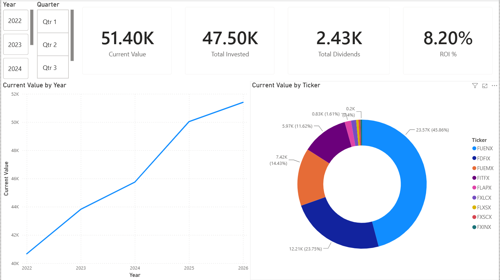
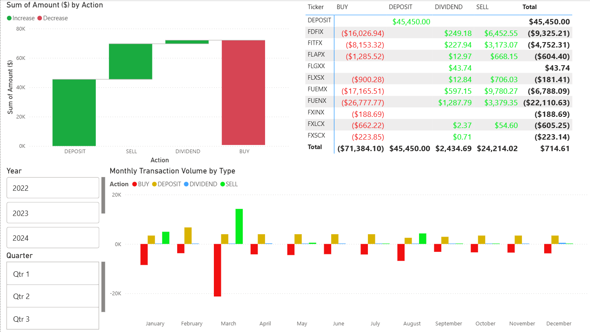
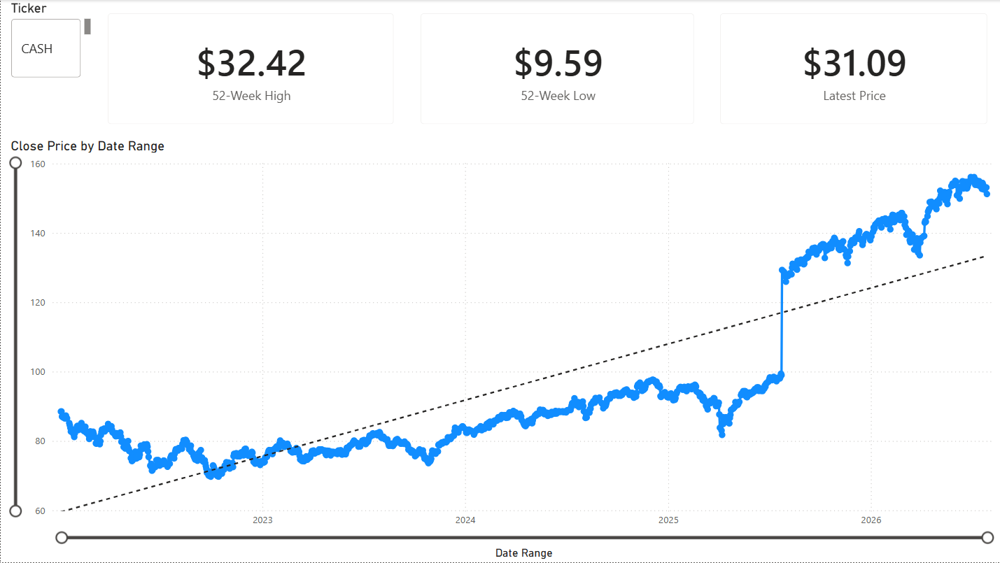
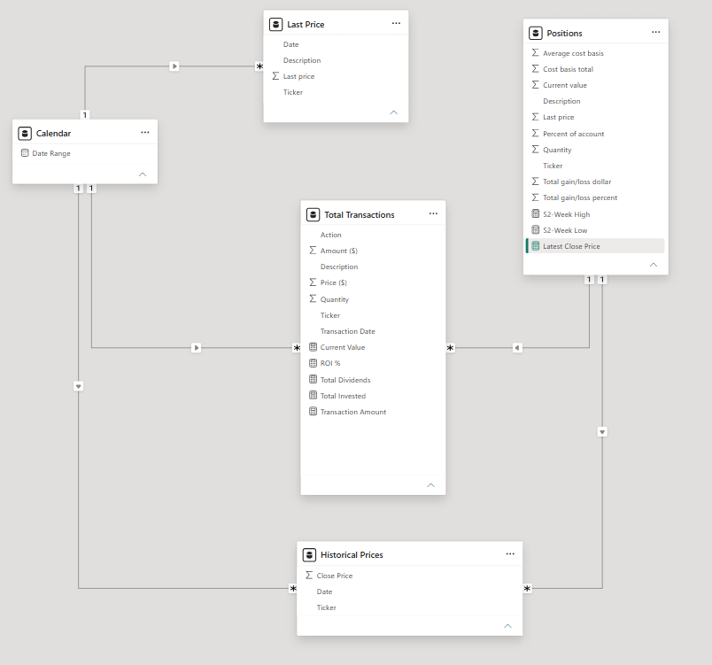

# 📈 Investment Portfolio Dashboard

## Project Overview

This project is an interactive Power BI dashboard built to analyze an investment portfolio using historical transaction data and current market prices.

The dashboard demonstrates data modeling, Power Query transformations, DAX calculations, and interactive reporting techniques commonly used by data analysts.

---

## Dashboard Preview

### Dashboard Overview






---

## Features

- Portfolio value tracking
- Current holdings
- Gain/Loss analysis
- Portfolio allocation
- Interactive slicers
- Dynamic KPIs

---

## Skills Demonstrated

- Power BI Desktop
- Power Query
- Data Modeling
- DAX
- Financial Analytics
- Data Visualization

---

## Data Model



---

## Technologies Used

- Power BI Desktop
- Excel
- DAX
- Power Query

---

## Repository Structure

```
investment-portfolio-powerbi/

README.md

Investment Portfolio.pbix

data/

screenshots/

docs/
```

---

## Future Improvements

- Connect to a live stock market API
- Add historical performance tracking
- Add benchmark comparison (S&P 500)
- Scheduled data refresh
- Additional financial KPIs
